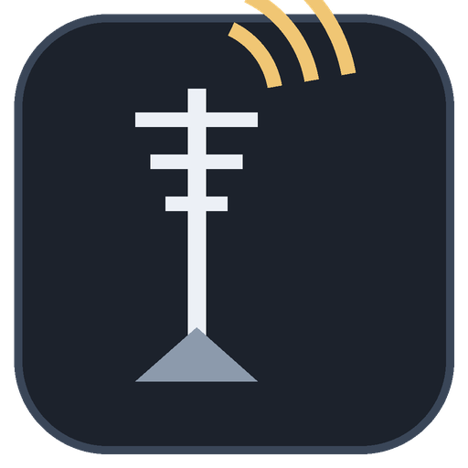
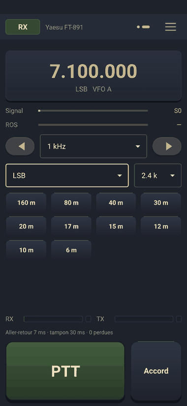
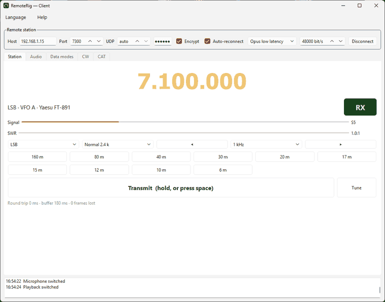
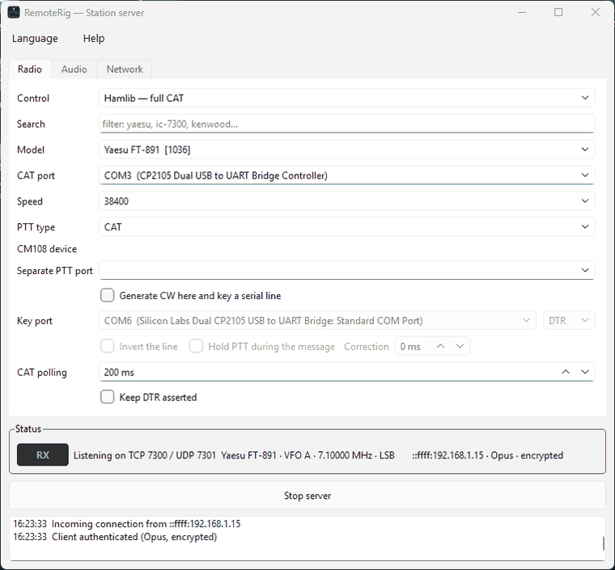

# RemoteRig

<p align="center">
  
</p>

Station radio déportée : un serveur tourne à côté du poste, un client tourne
là où vous êtes. Audio bidirectionnel, PTT, et pilotage CAT complet quand le
poste le permet.

C++17 / Qt6 / PortAudio / Opus / Hamlib. Windows, Linux et Android, même code.

*English version: [README.md](README.md)*


<p align="center">
  
</p>

<p align="center">
  
</p>

<p align="center">
  
</p>

*Le client tactile sur Android, le client bureau connecté à un FT-891, et le
serveur de station. Les autres onglets sont détaillés dans le manuel
d'utilisation, accessible par Aide → Manuel.*


---

## Architecture

```
       CLIENT                                        SERVEUR
  ┌──────────────────┐                        ┌────────────────────┐
  │ micro / câble    │──── UDP audio TX ─────▶│ sortie carte son   │──▶ MIC du poste
  │ virtuel          │                        │                    │
  │                  │◀─── UDP audio RX ──────│ entrée carte son   │◀── AF du poste
  │ rigctld :4532    │                        │                    │
  │  ↑ WSJT-X, fldigi│◀─── TCP contrôle ─────▶│ Hamlib / RTS / DTR │──▶ CAT + PTT
  └──────────────────┘   (JSON encadré)       └────────────────────┘
```

Deux canaux séparés, pour une raison précise : l'audio ne doit jamais attendre
une retransmission TCP. Le PTT part sur les deux à la fois — trois copies UDP
pour l'immédiateté, une commande TCP pour la certitude. Le serveur applique la
première qui arrive.

Chaque programme utilise trois threads : interface, réseau (priorité temps
critique), et pour le serveur un troisième dédié au dialogue série, pour qu'un
poste CAT lent ne retarde jamais l'audio.

## Langue de l'interface

Les deux programmes sont bilingues anglais/français. Au premier lancement, la
langue suit celle du système : française si la locale commence par `fr`,
anglaise sinon. Le menu **Langue** de chaque fenêtre permet de forcer l'une ou
l'autre ; le choix est mémorisé et le programme propose de redémarrer pour
l'appliquer.

Les chaînes sources sont en anglais, la traduction française vit dans
`i18n/remoterig_fr.ts` et le `.qm` compilé est embarqué dans les exécutables :
rien à installer à côté du binaire.

Pour retoucher une formulation :

```bash
lupdate -locations none -no-obsolete common server client -ts i18n/remoterig_fr.ts
linguist i18n/remoterig_fr.ts      # ou un éditeur de texte
```

CMake recompile le `.qm` tout seul si les outils Linguist sont présents. S'ils
manquent, le `.qm` livré avec les sources est utilisé tel quel et la compilation
aboutit quand même. Ajouter une troisième langue tient en deux lignes : un
`remoterig_xx.ts`, une entrée dans `i18n/translations.qrc`.

## Débit d'échantillonnage

Le protocole est figé à 48 kHz mono : c'est le seul débit qu'Opus accepte
nativement, celui de PulseAudio et PipeWire par défaut, et celui qu'attendent
WSJT-X, fldigi et VARA. Ajouter 44,1 kHz au protocole reviendrait à
rééchantillonner deux fois pour rien.

Le point délicat n'est pas ce choix, c'est que la carte son peut refuser le
48 kHz — typiquement une carte USB figée par le panneau son de Windows, ou une
carte ALSA sans plug. Le moteur audio traite ce cas à la frontière :

1. `Pa_IsFormatSupported` teste le 48 kHz, puis le débit natif de la carte,
   puis 44,1 / 96 / 32 / 24 / 16 / 8 kHz.
2. Sous Windows en WASAPI, `paWinWasapiAutoConvert` est armé : Windows convertit
   lui-même et le 48 kHz passe presque toujours du premier coup.
3. Si la carte impose malgré tout autre chose, un rééchantillonneur polyphase
   rationnel s'intercale dans le callback. Sinc fenêtré Blackman, 16 coefficients
   par phase (2 560 au total pour 44,1 → 48 kHz), gain unité à 0,1 % près,
   repliement sous -50 dB. Il coûte quelques microsecondes par trame et n'ajoute
   aucune latence perceptible.

L'onglet Audio affiche le débit négocié pour chaque périphérique et indique s'il
y a rééchantillonnage. Un sélecteur d'interface audio (WASAPI, MME, DirectSound,
ALSA, JACK…) permet de forcer le backend : sous Windows, préférez WASAPI, seul
capable de tenir des tampons de 240 échantillons.

## Budget de latence

| Étage | Opus 10 ms | PCM 16 bits |
|---|---|---|
| Capture (tampon 480 éch.) | 10 ms | 10 ms |
| Encodage | ~2,5 ms | 0 |
| Réseau LAN | 1–3 ms | 1–3 ms |
| Tampon de gigue | 40 ms (réglable 10–300) | idem |
| Restitution | 10 ms | 10 ms |
| **Total bouche-à-oreille** | **~65 ms** | **~62 ms** |

Sur réseau local, descendre le tampon de gigue à 20 ms et le tampon carte son à
240 échantillons ramène l'ensemble autour de 35 ms. Sur Internet, remontez le
tampon de gigue jusqu'à ce que le compteur de trames perdues cesse de grimper.

Débit : Opus 48 kbit/s en phonie, PCM 768 kbit/s. Le PCM ne se justifie qu'en
réseau local ou en numérique.

## Choix du codec

Opus en `RESTRICTED_LOWDELAY` est excellent en phonie et médiocre sur les
tonalités étroites : FT8, PSK31 et VARA perdent des décodages. Le sélecteur du
client bascule les deux extrémités à chaud, sans couper la liaison : le serveur
permute son encodeur et son décodeur à réception de la commande. Règle
simple : **Opus en phonie, PCM en numérique.**

## Mise en forme du micro

Un micro à perche porté près de la bouche souffre de l'effet de proximité :
tout ce qui est sous 300 Hz remonte de 10 à 15 dB, la voix arrive grave et
sourde en face, et la bande d'intelligibilité se retrouve masquée. L'onglet
Audio propose une chaîne de correction, sur le chemin d'émission, avant
l'encodage.

Quatre préréglages : **aucune**, **micro-casque à perche**, **micro de table**,
et **personnalisé**, qui donne accès aux quatre réglages — passe-haut, présence,
passe-bas et compression — avec un vumètre de réduction de gain pour régler à
l'œil.

Le préréglage casque mesure ceci, passe-haut 300 Hz, présence +6 dB à 2 kHz,
passe-bas 3,2 kHz :

| Fréquence | 80 Hz | 150 Hz | 300 Hz | 600 Hz | 1 kHz | 2 kHz | 3 kHz | 3,5 kHz |
|---|---|---|---|---|---|---|---|---|
| Réponse | -23 dB | -12 dB | -3 dB | +0,5 dB | +2 dB | **+5,4 dB** | +1 dB | -1 dB |

**La latence est rigoureusement nulle.** Rien que des biquads récursifs et un
compresseur sans anticipation : aucun échantillon n'est retenu, ce qu'un test
par impulsion confirme — la sortie démarre sur l'échantillon même où
l'impulsion arrive.

La distorsion reste inaudible sur toute la plage utile, mesurée sur un 1 kHz :

| Entrée | -30 dBFS | -20 dBFS | -12 dBFS | -6 dBFS | -3 dBFS |
|---|---|---|---|---|---|
| Réduction de gain | 0 dB | 0 dB | 3,6 dB | 7,6 dB | 9,6 dB |
| THD+N | 0,053 % | 0,018 % | 0,009 % | 0,004 % | 0,006 % |

Deux choix y veillent : le genou du compresseur est quadratique, donc la pente
ne casse jamais à l'entrée en compression, et le gain lui-même est lissé en dB
avec 5 ms d'attaque et 150 ms de retour. Au-delà de -1 dBFS, un écrêteur doux
prend le relais en dernier ressort, sans brutalité — 0,97 % de THD, toujours
sans angle vif.

**Passez le préréglage sur « aucune » en numérique.** Un compresseur détruit les
tonalités de FT8, PSK et VARA. Les filtres sont par ailleurs réinitialisés à
chaque passage en émission, pour que la première syllabe ne soit jamais colorée
par un état résiduel.


## Faire tourner le serveur sans bureau

Une station déportée n'a aucune raison de faire tourner un bureau. Le serveur
accepte `--headless` : il lit la configuration établie par l'interface, ouvre le
poste et les flux audio, et journalise sur la sortie standard, où systemd la
ramasse.

```bash
remoterig-server --headless           # la configuration faite dans l'interface
remoterig-server --headless -v        # ... et les changements de fréquence
remoterig-server --config poste2.ini --headless
```

Réglez une fois avec un écran, puis faites tourner sans. `--config` lit un
`.ini` à la place, ce qui permet à une machine de servir plusieurs postes, chacun
avec son fichier et ses ports. Les clés sont celles qu'écrit l'interface ;
`backendName` (`hamlib`, `serial`, `none`), `audioIn` et `audioOut` en sont des
alias plus lisibles pour un fichier écrit à la main. Les périphériques audio sont
retrouvés **par leur nom**, pas par un index, qui se décale au moindre
branchement.

Le paquet installe une unité systemd utilisateur :

```bash
systemctl --user enable --now remoterig-server
journalctl --user -u remoterig-server -f
sudo loginctl enable-linger $USER     # tourner sans session ouverte
```

Au démarrage, il affiche les adresses que l'opérateur distant doit saisir, et
avertit si le mot de passe est vide. Le journal reste ensuite discret : bascules
d'émission, connexions et erreurs seulement, sauf avec `-v`.


## Reconnexion automatique

Une liaison coupée se rétablit seule. Le client distingue ce que l'opérateur a
demandé de l'état du lien : seule une coupure qu'il n'a pas voulue est
poursuivie. Une première tentative suit d'une seconde, puis le délai double
jusqu'à trente — assez long pour ne pas marteler une station éteinte, assez
court pour rattraper une bascule Wi-Fi sans que l'opérateur s'en aperçoive.

Le délai repart à zéro au succès, et le journal indique combien de tentatives
ont été nécessaires. Pendant l'attente, le bouton de connexion devient
**Renoncer**, pour pouvoir arrêter les essais ; sans cela l'opérateur n'aurait
aucune issue. L'émission est relâchée dès la perte du lien, pour qu'un poste ne
reste jamais en émission.

Les échecs d'ouverture comptent aussi : une station encore en train de démarrer,
ou un périphérique audio pas encore branché, sont réessayés au même rythme
plutôt qu'abandonnés.

L'interrupteur est actif par défaut, à côté des réglages de connexion.


## Envoi du CW

Deux voies, selon ce que le poste accepte.

**Le poste manipule lui-même.** Le texte part par le CAT — `rig_send_morse` — et
son manipulateur électronique génère les éléments. C'est la voie la plus simple
quand elle fonctionne.

Elle ne fonctionne pas partout. Sur les Yaesu HF, la commande de manipulateur ne
sait que rejouer les mémoires internes du poste : envoyer `AGN?` déclenche la
mémoire 1, quel que soit le texte. Cinq boutons appellent donc ces mémoires
directement, numérotées de 1 à 5, dans le panneau CW et dans l'onglet du client
bureau.

**Le serveur génère les éléments.** Pour ces postes-là, le serveur produit
lui-même les points et les traits et bascule une ligne série câblée sur la prise
KEY. Voir *CW généré par le serveur* plus bas. Le réseau n'intervient jamais
dans l'espacement : seul le texte voyage.

Le manipulateur du poste n'apparaît que s'il le gère. Hamlib n'expose aucun
drapeau de capacité pour le morse : le serveur vérifie donc si le backend
fournit une fonction `send_morse`. Sur un poste qui n'en a pas, rien ne
s'affiche, plutôt qu'une commande qui échouerait en silence.

Sur téléphone, un bouton point-trait siège dans le bandeau et ouvre un panneau
par le haut : vitesse, six mémoires logicielles, les cinq mémoires du poste, un
champ libre, et un bouton d'arrêt toujours à portée — une mémoire lancée par
erreur doit pouvoir être coupée sans chercher. Sur le bureau, les mêmes
fonctions occupent un onglet **CW**.

Les mémoires logicielles utilisent `%c` pour l'indicatif de l'opérateur, ce qui
les garde valables quel que soit celui qui utilise l'application. La vitesse
passe par `RIG_LEVEL_KEYSPD`, et sert aussi à cadencer le manipulateur du
serveur.

Pendant la manipulation, l'indicateur affiche CW et le bouton d'émission est
verrouillé, comme pendant un cycle d'accord : le poste émet déjà, et lui
superposer le PTT réseau le ferait osciller entre les deux.

## ROS

Le poste rapporte lui-même son rapport d'ondes stationnaires par
`RIG_LEVEL_SWR`, lu sur la même boucle de scrutation que le S-mètre et affiché
dans le même gabarit, juste en dessous. La ligne n'apparaît que si le poste
répond à ce niveau et que le CAT est en direct.

Deux décisions comptent plus que l'affichage lui-même. Le ROS ne se mesure qu'en
émission — il n'y a pas d'onde réfléchie à mesurer en réception — il n'est donc
lu que sous PTT. Et la dernière valeur est **conservée** au relâchement, comme
une aiguille qui retombe : sans cela, le chiffre disparaîtrait à l'instant où
l'opérateur lâche le bouton, juste avant qu'il ait pu le lire. Une nouvelle
émission la remet à zéro, pour que le ROS du QSO précédent ne soit jamais pris
pour celui de l'antenne en service.

L'échelle va de 1:1 à 3:1 ; au-delà la barre sature et c'est le chiffre qui
renseigne. Il passe au rouge à 2:1, seuil au-delà duquel il est imprudent
d'émettre longtemps.


## Garde-fou de bord de bande et vumètres

**Le serveur refuse l'émission hors bande.** Le poste déclare déjà ses plages
d'émission — la même liste qui sert à construire les boutons de bande — donc le
serveur y compare le **spectre émis**, et non la porteuse. Le poste rapporte sa
porteuse ; en USB l'émission se place au-dessus, en LSB au-dessous. À
7,200 000 MHz exactement, la LSB reste dans le 40 m quand l'USB en sort — juger
la porteuse seule serait faux dans les deux sens. Le spectre est déduit du mode
et de la largeur du filtre, avec des valeurs de repli quand le poste ne rapporte
pas son filtre, et le client affiche les bornes calculées pour que le refus ne
soit jamais mystérieux. Le
client grise son bouton d'émission et le libelle HORS BANDE, et le serveur
refuse la commande de toute façon : le client n'est pas seul à pouvoir
l'envoyer. Franchir le bord en pleine émission coupe le PTT immédiatement.

Le garde-fou ne s'applique que si le CAT est en direct et les plages connues ;
sans moyen de juger, il laisse passer. Il se désactive aussi côté serveur, pour
un transverter dont la plage de travail n'est pas celle du poste.

**Les vumètres maintiennent la crête et signalent l'écrêtage.** Une barre qui ne
montre que l'instant ne permet pas de régler un niveau micro : ce qui compte est
jusqu'où il est monté, et s'il a touché la butée. Le trait de crête tient une
seconde et demie, puis retombe doucement plutôt que de rester accroché à un
claquement isolé. Le carré de droite s'allume plus d'une seconde dès qu'un
échantillon atteint la butée — un seul échantillon écrêté est invisible dans une
crête lue quatre fois par seconde, le moteur audio le retient donc dans le
callback lui-même.


## Modes et largeur de filtre

Aucune des deux listes n'est figée. Le poste déclare ses modes par le masque
`mode_list` de Hamlib ; le serveur en parcourt les bits et envoie les noms : un
bibande FM n'a que faire de PKTLSB, un HF le réclame. Hors connexion, les
clients affichent une liste de repère, PKTLSB compris.

Le filtre vient de `rig_passband_wide`, `_normal` et `_narrow`, calculés pour le
**mode courant** — c'est pourquoi les trois largeurs voyagent avec l'état du
poste et non avec les capacités, envoyées une seule fois. En choisir une appelle
`rig_set_mode` avec le même mode et la nouvelle largeur ; le poste répond ce
qu'il a réellement appliqué, et la liste suit.

Le bureau affiche le nom et la largeur, « Normale 2,4 k ». Le téléphone affiche
la largeur seule, « 2,4 k » : elle tient à côté du mode et du VFO, et c'est
ainsi que les postes étiquettent leurs propres filtres. Les trois sont rangées
de la plus large à la plus étroite, l'ordre porte le sens.


## Formes de PTT

Quatre manières de commuter le poste, au choix sur le serveur.

**CAT** envoie la commande par la liaison de contrôle. Rien à câbler, mais
l'instant de la commutation dépend de la réponse du poste.

**RTS ou DTR** bascule une ligne du port série. Simple et répandu ; il faut
indiquer au poste, dans ses propres menus, quelle ligne il doit surveiller.

Une interface qui n'expose **aucun port série** — la Digirig Lite en est une —
dispose de son propre pilotage, **PTT par GPIO CM108 seul** : pas de CAT, pas de
port série, le PTT seul par GPIO3. Le choisir masque les champs de port et de
vitesse, qui n'ont plus rien à piloter, et fait apparaître ceux du CM108.

Sous Linux, la ligne de PTT se trouve derrière `/dev/hidraw*`, que seul root
peut ouvrir par défaut. Une règle udev est livrée avec le projet et confie
l'accès à l'utilisateur de la session graphique en cours. Le paquet Debian
l'installe dans `/usr/lib/udev/rules.d` et recharge udev ; `install.sh` propose
de la poser, le fait sans demander avec `--udev`, et la retire à
`--uninstall`. Débranchez et rebranchez l'interface ensuite.

**CM108 / GPIO3** attaque la ligne de commande d'une puce audio de la famille
CM108 — Digirig, cartes RA, nombre de câbles maison. Hamlib écrit directement
dans le périphérique HID : aucun port série dans le chemin. C'est la méthode la
plus précise, et celle à préférer en numérique, où l'instant de la commutation
compte. Laissez le champ du périphérique vide pour que Hamlib trouve la carte,
ou donnez un chemin comme `/dev/hidraw0`. Le numéro de GPIO reste sur 3, sauf si
votre interface en câble une autre. Sous Linux, écrire dans un périphérique HID
demande généralement une règle udev, ou l'appartenance au groupe propriétaire de
`/dev/hidraw*`.

**La tonalité de PTT** convient aux interfaces qui commutent le poste dès
qu'elles détectent un signal sur le canal droit. La sortie est ouverte en
stéréo, la modulation reste à gauche, et une tonalité — 2200 Hz par défaut,
réglable — part à droite exactement le temps de l'émission, en commençant un
instant avant le premier échantillon utile. Vérifiez que le poste n'est alimenté
que par le canal gauche, sans quoi la tonalité serait elle aussi transmise.


### CW généré par le serveur

Certains postes n'acceptent pas de texte libre par le CAT : la commande est
refusée, ou le poste manipule une de ses mémoires internes au lieu du texte.
Pour ceux-là, le serveur peut produire les éléments lui-même et manipuler une
ligne série câblée sur la prise KEY du poste.

Essayez d'abord le manipulateur du poste : il ne demande aucun câblage, et sur
un FT-891 piloté en CAT il transmet bien le texte. Ce qui suit est le recours
lorsqu'il ne fonctionne pas.

Cochez **Générer le CW ici et manipuler une ligne série**, choisissez le port et
la ligne, DTR ou RTS. Elle peut être inversée pour les interfaces qui la
présentent à l'envers, et le PTT peut être maintenu pendant tout le message sur
les postes qui ne commutent pas seuls.

La **correction** raccourcit chaque élément manipulé, jamais les silences, pour
compenser le temps que met le poste à établir sa porteuse. Commencez à zéro, et
ne l'augmentez que si vos correspondants signalent des points écourtés.

Le réseau n'intervient jamais dans l'espacement : seul le texte voyage, la
cadence est produite à côté du poste. Le manipulateur tourne dans son propre fil
— la scrutation du poste fait des lectures série qui peuvent durer des dizaines
de millisecondes et décaleraient les éléments — et l'échéance de chaque élément
est comptée depuis un instant de référence unique, si bien qu'un minuteur en
retard ne se reporte pas sur la suite. Mesuré sur un port virtuel : « PARIS
PARIS » à 20 mots par minute a duré 5581 ms pour 5580 attendues.

Le port de manipulation doit être différent de celui que tient déjà le pilotage
du poste : un port série ne s'ouvre pas deux fois. Les postes qui exposent deux
ports USB, et les interfaces comme la SCU-17, vous en laissent un pour cela.


### Écrire puis relire, et CAT brute

Chaque changement de fréquence, de mode et de VFO est **relu** après avoir été
écrit. Les postes arrondissent au pas de leur VFO, refusent en silence hors de
leurs plages, ou retombent sur un mode voisin ; sans relecture, l'opérateur
croirait la commande passée. Quand ce que le poste annonce diffère, le journal
dit les deux : ce qui a été demandé, et ce qui est revenu.

Un champ de **CAT brute** envoie une séquence telle quelle au poste, pour les
réglages qu'aucun pilote ne couvre — un menu propre à un modèle, une fonction
rare. Le terminateur est ajouté s'il manque, rien d'autre n'est interprété, et
la réponse du poste revient dans le journal. Il dispose de son propre onglet **CAT**
dans le client bureau, avec un mode d'emploi de la syntaxe et son journal
propre, et se trouve dans le tiroir sur téléphone.


### Les commandes de l'opérateur passent d'abord

Le cycle de scrutation fait jusqu'à six allers-retours vers le poste :
fréquence, mode, VFO, PTT, S-mètre, ROS. Sans précaution, un bouton de bande
pressé en milieu de cycle attend les six avant que sa commande ne parte. Sur un
poste au délai CAT généreux, cela se sent.

Chaque commande d'opérateur pose donc un jeton dès son émission, depuis le fil
qui l'émet, et la scrutation consulte ce jeton entre deux lectures. Elle
abandonne le reste de son cycle et laisse passer la commande. L'état reste
cohérent parce que le cycle part d'une copie de l'état courant : un champ non
relu conserve simplement sa valeur.

Un garde-fou en borne l'effet. Si un jeton restait en l'air — commande émise
mais jamais délivrée — l'affichage se figerait ; au-delà de cinq cycles sautés,
le compteur est remis à zéro et tout est relu. L'idée vient d'OmniRig, dont la
file insère les écritures de l'opérateur devant les commandes d'état.

## Bandes et coupleur d'antenne

Les boutons de bande ne sont pas une liste figée. À la connexion, le serveur lit
les plages d'émission du poste dans Hamlib — `tx_range_list`, normalisée à
`rig_open` pour la région ITU que le poste annonce — et les envoie au client,
qui les croise avec un plan de bandes de référence allant du 2200 m au 23 cm.
Chaque poste affiche donc ses propres bandes, avec une fréquence proposée
ramenée dans ce qu'il sait réellement émettre. Sans CAT, le plan complet est
affiché à titre de repère.

Un bouton **Accord** apparaît quand `rig_has_vfo_op` signale `RIG_OP_TUNE` **et**
que le poste répond en CAT — les capacités décrivent ce qu'un poste sait faire,
`hasCat` ce qu'il fait à l'instant, et un poste ouvert mais muet laisserait sinon
un bouton sans effet. Les capacités sont par ailleurs remises à zéro à chaque
ouverture : passer d'un poste piloté en CAT à un simple PTT série ne laisse plus
traîner les bandes et les boutons du précédent. Il
reste caché sur les postes qui ne le gèrent pas, plutôt que d'échouer en
silence. Un cycle d'accord met le poste en émission plusieurs secondes : le
serveur verrouille donc le PTT pendant ce temps — l'indicateur affiche ACCORD,
le bouton d'émission est désactivé, et une demande de PTT qui arriverait entre
temps est ignorée. Le verrou tombe quand le poste repose son propre PTT, avec
1,5 s de grâce pour ne pas conclure avant que le cycle ne démarre, et une limite
dure de 15 s si le poste ne rend jamais la main.

## Manuel d'utilisation

`docs/manual-fr.html` et `docs/manual-en.html` couvrent les deux applications
bureau : principe, installation sur les trois systèmes, chaque réglage du
serveur et du client, exploitation, modes numériques, sécurité, et un tableau de
dépannage.

Ce sont des fichiers uniques et autonomes — feuille de style incluse, logo
encodé en base64 — et ils sont en outre **compilés dans les deux exécutables**.
L'entrée **Manuel d'utilisation** du menu Aide, touche F1, extrait celui qui
correspond à la langue de l'interface dans un fichier temporaire et l'ouvre dans
le navigateur du système : il est donc disponible quelle que soit
l'installation, même en lançant depuis un dossier de compilation. Le paquet les
installe aussi dans `share/doc/remoterig`.


## Surveillance du client

Un client qui disparaît sans fermer sa connexion — téléphone éteint, Wi-Fi
coupé — laisserait sinon le poste en émission. TCP ne s'aperçoit d'une
disparition silencieuse qu'au bout de dizaines de minutes, et le PTT est envoyé
comme un événement, non comme un flux continu.

Le serveur date donc tout ce qu'il reçoit du client, aussi bien sur la voie de
contrôle que sur le flux audio. Deux seuils :

- **deux secondes** de silence, PTT enfoncé, coupent l'émission ;
- **quinze secondes** libèrent la station, pour qu'un autre client puisse
  reprendre.

Les deux sont confortables : un client en émission envoie un datagramme audio
toutes les dix millisecondes, et interroge la voie de contrôle plusieurs fois
par seconde.

`test/protocol_probe.py` et `test/deadman_probe.py` parlent le protocole à la
main et vérifient tout cela, ainsi que les mots de passe faux, les signatures
forgées, les trames malformées, les longueurs aberrantes, les paquets de PTT
contrefaits et un second client qui tenterait de prendre la station.

## Sécurité

- Authentification défi/réponse : PBKDF2-HMAC-SHA256 (60 000 tours) puis HMAC
  sur deux aléas. Le mot de passe ne circule jamais.
- Chiffrement facultatif ChaCha20 sur les deux canaux, MAC tronqué sur le
  contrôle. Implémentation autonome, aucune dépendance TLS à installer.
- Les datagrammes PTT portent un jeton dérivé de la session : un tiers ne peut
  pas mettre le poste en émission, même en connaissant les ports.

Sur réseau local ou tunnel VPN, laissez le chiffrement décoché : il coûte
quelques dizaines de microsecondes par trame. Exposé sur Internet, cochez-le des
deux côtés, et cochez côté serveur « refuser les clients qui ne chiffrent pas ».

## Postes sans CAT

Choisissez « Port série — PTT seul » : le programme n'ouvre le port que pour
basculer RTS ou DTR. Le client grise alors tout ce qui exigerait le CAT —
bandes, modes, VFO, pas d'accord, S-mètre — et affiche « pas de CAT » à la place
de la fréquence. L'audio et le PTT fonctionnent normalement. L'option
« maintenir DTR actif » alimente les interfaces qui tirent leur courant de la
ligne, comme les Digirig.

## Modes numériques

Le client publie une interface **rigctld** sur 127.0.0.1:4532.

1. Onglet Numérique : cochez « publier une interface rigctld ».
2. Onglet Audio : choisissez le câble virtuel des deux côtés
   (VB-Audio Cable sous Windows ; `pactl load-module module-null-sink` ou un
   nœud PipeWire sous Linux).
3. Dans WSJT-X / fldigi / JS8Call : radio « Hamlib NET rigctl », 127.0.0.1:4532,
   PTT « CAT ». Audio : l'autre extrémité du câble virtuel.
4. Passez le codec sur PCM 16 bits.


---

# Compilation sous Debian et dérivés

Testé sous Ubuntu 24.04 (Qt 6.4.2, Hamlib 4.5.5). Debian 12 « bookworm » et
suivantes, Ubuntu 22.04 et suivantes, Linux Mint et Raspberry Pi OS portent les
mêmes noms de paquets.

### 1. Dépendances

```bash
sudo apt update
sudo apt install build-essential cmake git \
  qt6-base-dev qt6-serialport-dev \
  portaudio19-dev libopus-dev libhamlib-dev
```

Facultatif, pour régénérer les traductions depuis le `.ts` :

```bash
sudo apt install qt6-tools-dev qt6-l10n-tools
```

Sans eux la compilation fonctionne quand même et utilise le `.qm` livré.

| Paquet | À quoi il sert |
|---|---|
| `qt6-base-dev` | Core, Gui, Widgets, Network |
| `qt6-serialport-dev` | PTT RTS/DTR pour les postes sans CAT |
| `portaudio19-dev` | capture et restitution audio |
| `libopus-dev` | codec voix faible latence (facultatif) |
| `libhamlib-dev` | pilotage CAT (facultatif) |

### Paquets supplémentaires pour le client tactile

L'interface Qt Quick réclame les modules d'exécution QML en plus des paquets
ci-dessus. Ils sont séparés sur Debian et Ubuntu, et leur absence se manifeste
par une fenêtre qui s'ouvre vide plutôt que par une erreur de compilation :

```bash
sudo apt install qt6-declarative-dev \
  qml6-module-qtquick qml6-module-qtquick-controls \
  qml6-module-qtquick-layouts qml6-module-qtquick-templates \
  qml6-module-qtquick-window qml6-module-qtqml-workerscript
```

Ajoutez ensuite `-DWITH_QML_CLIENT=ON` à la ligne cmake. Un troisième programme
en sort, `remoterig-client-qml`.

### 2. Compilation

```bash
cmake -B build -DCMAKE_BUILD_TYPE=Release
cmake --build build -j$(nproc)
```

Les deux exécutables sortent dans `build/` :

```bash
./build/remoterig-server    # côté poste
./build/remoterig-client    # côté opérateur
```

### Paquet Debian

Le script installe d'abord les dépendances manquantes, puis compile et fabrique
le paquet :

```bash
./make_deb.sh            # demande avant d'installer ce qui manque
./make_deb.sh --deps     # installe sans demander
./make_deb.sh --no-deps  # ne vérifie rien
```

Il limite aussi le nombre de tâches de compilation d'après la mémoire
disponible, et non d'après le seul nombre de cœurs : compiler du Qt demande
environ 700 Mio par tâche, et un Raspberry Pi 4 à 2 Gio qui en lancerait quatre
se ferait tuer par le noyau en cours de route. Sur un Pi à 2 Gio il en lance
deux, sur un Pi à 1 Gio une seule.

`make_deb.sh` produit un `.deb` pour la machine sur laquelle il tourne :

```bash
./make_deb.sh            # serveur, client bureau, client tactile
./make_deb.sh --no-qml   # sans le client Qt Quick
./make_deb.sh --check    # et passe lintian sur le resultat
```

Installez-le avec `apt`, pas avec `dpkg -i`, pour que les dépendances suivent :

```bash
sudo apt install build-deb/remoterig_1.0.0_amd64.deb
```

**Un `.deb` contient du code compilé : une architecture égale un paquet.**
`amd64` pour un PC, `arm64` pour un Raspberry Pi 64 bits, `armhf` pour un
32 bits. Il faut compiler sur chaque machine, il n'existe pas de paquet
universel.

Les dépendances ne sont pas écrites à la main. `dpkg-shlibdeps` lit les
bibliothèques réellement liées aux binaires et nomme les paquets qui les
fournissent, ce qui donne la bonne réponse sur Ubuntu comme sur Raspberry Pi OS
malgré leurs versions de Qt différentes. Les six paquets `qml6-module-*` font
exception : le moteur QML les charge à l'exécution, aucun outil ne peut le
deviner, ils sont donc déclarés explicitement. Sans eux, le client tactile ouvre
une fenêtre vide sans rien dire.

Le paquet installe les trois programmes, leurs raccourcis, les icônes en neuf
tailles, les pages de manuel, et rafraîchit les caches du bureau à
l'installation. `lintian` ne signale rien.

### 3. Installation

`install.sh` et `make_deb.sh` installent tous deux les dépendances manquantes
avant de compiler, depuis la même liste — `packaging/build-deps.sh` — pour
qu'elles ne divergent pas :

```bash
./install.sh            # demande avant d'installer ce qui manque
./install.sh --deps     # installe sans demander
./install.sh --no-deps  # ne vérifie rien
```

Ils bornent aussi le nombre de tâches de compilation par la mémoire disponible,
et non par le seul nombre de cœurs.


`install.sh` compile si besoin, puis pose les programmes, leurs icônes et leurs
raccourcis là où le bureau les attend.

```bash
./install.sh                  # pour vous seul, dans ~/.local, sans root
sudo ./install.sh --system    # pour tout le monde, dans /usr/local
```

Les entrées apparaissent ensuite dans le menu sous Internet ou Audio, chacune
avec son icône, en français ou en anglais selon la langue de la session. Les
icônes sont installées en neuf tailles, de 16 à 512 px, pour que le tableau de
bord, le menu et le sélecteur de fenêtres trouvent chacun la leur.

Autres options : `--client-only` et `--server-only` pour n'installer qu'un
programme, `--no-build` pour réutiliser les binaires déjà dans `build/`,
`--prefix DIR` pour installer ailleurs, et `--uninstall` pour tout retirer. Les
réglages sous `~/.config/F4JTV` sont toujours laissés en place.

### 4. Droits sur le port série

Votre utilisateur doit appartenir au groupe propriétaire du port série, sinon
Hamlib ne pourra pas l'ouvrir :

```bash
sudo usermod -a -G dialout $USER      # plugdev sur certaines distributions
```

Il faut se déconnecter et se reconnecter pour que ça prenne effet.

### 5. Installation manuelle

`install.sh` reste le chemin le plus simple. Pour ne poser que les binaires,
sans icônes ni entrées de menu :

```bash
sudo cmake --install build            # dans /usr/local/bin
```

### Désactiver une dépendance facultative

```bash
cmake -B build -DWITH_HAMLIB=OFF      # PTT série uniquement
cmake -B build -DWITH_OPUS=OFF        # PCM 16 bits uniquement
```

## Raspberry Pi 4 et 5

Tout compile et tourne sur un Pi. La section Debian ci-dessus s'applique telle
quelle : Raspberry Pi OS Bookworm est un Debian 12, et fournit `qt6-base-dev`,
`qt6-serialport-dev`, `portaudio19-dev`, `libopus-dev` et `libhamlib-dev` en
arm64 comme en armhf.

```bash
sudo apt install build-essential cmake git \
  qt6-base-dev qt6-serialport-dev \
  portaudio19-dev libopus-dev libhamlib-dev
cmake -B build -DCMAKE_BUILD_TYPE=Release
cmake --build build -j4
```

Préférez le système **64 bits** : c'est celui par défaut sur Pi 4 et 5, et la
compilation y est sensiblement plus rapide. Le 32 bits fonctionne aussi,
vérifié ci-dessous.

### Ce qui a été vérifié

Le cœur du code en C++ pur a été compilé en croisé pour `aarch64` et `armhf`,
puis exécuté sous qemu. Les résultats sont identiques au x86-64, octet pour
octet :

| | x86-64 | aarch64 | armhf |
|---|---|---|---|
| Taille et décalages de `PktHeader` | 24 / 12 / 20 | 24 / 12 / 20 | 24 / 12 / 20 |
| ChaCha20, vecteur RFC 8439 | conforme | conforme | conforme |
| Rééchantillonneur, comptes et gain | référence | identique | identique |
| Bouclage de la file circulaire | ok | ok | ok |

Un point à connaître : `char` est **non signé** sur ARM et signé sur x86. Aucune
partie du code n'en dépend, ce que l'identité des résultats confirme. L'en-tête
du protocole n'emploie que des types de largeur fixe et des conversions
petit-boutistes explicites : un Pi et un PC échangent donc les mêmes octets.

Chaque fichier source a également passé un contrôle syntaxique avec les
compilateurs `aarch64` et `armhf`, avertissements activés, sans une remarque.

### Charge processeur

Mesuré sur un cœur x86-64, par trame audio de 10 ms :

| | Temps | Part d'un cœur |
|---|---|---|
| Rééchantillonnage 44,1 → 48 kHz | 9,7 µs | 0,10 % |
| Opus, encodage + décodage | 42,4 µs | 0,42 % |

Un cœur de Pi 4 est plusieurs fois plus lent, mais la marge est large : même dix
fois plus lent, toute la chaîne audio reste autour de 5 % d'un cœur. Un Pi 4 est
à l'aise pour l'un ou l'autre programme, un Pi 5 davantage.

### Points pratiques

- **Une carte son USB est indispensable côté serveur.** La prise jack du Pi 4
  est une sortie seulement, et le Pi 5 n'a plus de sortie analogique du tout.
  N'importe quel CODEC USB convient : un Digirig, une interface CM108, ou une
  simple clé USB audio.
- **Si un micro USB n'apparaît pas dans la liste**, c'est que PortAudio n'a pas
  pu l'énumérer, généralement parce que PipeWire tient la carte. Lancez
  `remoterig-client --list-audio` pour voir exactement ce que PortAudio voit. Le
  remède est de déclarer un PCM nommé dans `~/.asoundrc`, pointant sur la carte
  que `arecord -l` rapporte :

  ```
  pcm.rr_micro {
      type plug
      slave.pcm "hw:3,0"
  }
  ```

  `rr_micro` apparaît alors dans la liste des micros. Le type `plug` se charge
  de la conversion de format et de débit, donc un casque limité au 16 kHz mono
  fonctionne aussi.
- Beaucoup de CODEC USB sont figés en 44,1 ou 48 kHz. Le moteur négocie le débit
  et rééchantillonne si besoin ; l'onglet Audio indique celui qu'il a obtenu.
- Sur Raspberry Pi OS Lite, il n'y a ni PulseAudio ni PipeWire : PortAudio parle
  directement à ALSA. C'est le chemin le plus court en latence, et aussi le plus
  strict sur les débits.
- Les deux programmes ont une interface graphique : le serveur demande donc une
  session de bureau — Raspberry Pi OS Desktop, ou Lite avec VNC.
- L'accès au port série passe par le groupe :
  `sudo usermod -a -G dialout $USER`, puis déconnexion et reconnexion.
- Le thread réseau demande une priorité temps critique. Sans privilèges, Linux
  ignore silencieusement la demande et le thread tourne en priorité normale, ce
  qui suffit ; pour l'accorder réellement, ajoutez `@audio - rtprio 95` dans
  `/etc/security/limits.conf` et mettez votre utilisateur dans le groupe
  `audio`.


---

# Compilation sous Windows

Deux points à connaître avant de commencer :

- **vcpkg fournit PortAudio et Opus, mais pas Hamlib pour MSVC.** Le port
  `hamlib` déclare `"supports": "!windows | mingw"`. Hamlib vient donc du paquet
  binaire Windows officiel, et il faut fabriquer une bibliothèque d'import à
  partir du fichier `.def` fourni. C'est une seule commande.
- Le client n'a besoin ni de Hamlib ni d'un port série. Si vous ne compilez que
  le client, sautez entièrement l'étape 4.

### 1. Outils de compilation

Installez **Visual Studio 2026** ou **2022** (l'édition Community suffit) ou,
plus léger, les **Build Tools** correspondants, en cochant la charge de travail
*Développement Desktop en C++*. Cela apporte le compilateur MSVC, le SDK
Windows, CMake et `lib.exe`.

Les deux conviennent. Deux points à connaître si vous partez sur les Build
Tools 2026 :

- Le générateur CMake `Visual Studio 18 2026` **exige CMake 4.2 ou plus
  récent**. Le CMake livré avec VS 2026 l'est ; un CMake installé séparément et
  plus ancien ne l'est pas. Si `cmake -B build` proteste sur le générateur,
  utilisez celui fourni, ou ajoutez `-G Ninja` depuis la Developer Command
  Prompt : Ninja fonctionne avec n'importe quelle version de CMake puisqu'il
  reprend `cl.exe` dans l'environnement.
- **Prenez un vcpkg récent.** Les clones anciens détectent Visual Studio via
  `vswhere` et ignorent la version 18. Un `git pull` suivi de
  `bootstrap-vcpkg.bat` suffit.

Qt n'a pas besoin de correspondre : MSVC 14.51, le toolset par défaut de
VS 2026, conserve la compatibilité binaire avec tout ce qui est compilé depuis
Visual Studio 2015. Les paquets Qt `msvc2022_64` se lient donc sans problème
sous VS 2026.

Installez aussi **Git pour Windows** (<https://git-scm.com/download/win>),
nécessaire à vcpkg.

### 2. Qt 6

Téléchargez l'installateur en ligne de Qt sur
<https://www.qt.io/download-qt-installer>. Un compte gratuit est demandé. Dans
le sélecteur de composants, sous la dernière version de Qt 6, cochez :

- **MSVC 2022 64-bit**
- **Qt Serial Port** (dans *Additional Libraries*)

Notez le chemin d'installation, par exemple `C:\Qt\6.8.1\msvc2022_64`.

### 3. vcpkg, PortAudio et Opus

Ouvrez une **Developer Command Prompt for VS 2022** (menu Démarrer) :

```bat
cd C:\
git clone https://github.com/microsoft/vcpkg.git
cd vcpkg
bootstrap-vcpkg.bat
vcpkg install portaudio:x64-windows opus:x64-windows
```

La première compilation prend plusieurs minutes : vcpkg construit les deux
bibliothèques depuis les sources. Le résultat atterrit dans
`C:\vcpkg\installed\x64-windows`.

Le PortAudio de vcpkg est compilé avec WASAPI, DirectSound et MME, ce qui est
exactement ce qu'il faut — WASAPI est le seul backend qui tienne de petits
tampons.

### 4. Hamlib (serveur seulement)

Téléchargez `hamlib-w64-4.7.2.zip` depuis
<https://github.com/Hamlib/Hamlib/releases> et décompressez-le dans
`C:\hamlib`, de sorte que `C:\hamlib\include\hamlib\rig.h` existe.

Le paquet est compilé en croisé avec MinGW et ne contient aucune bibliothèque
d'import MSVC, seulement le fichier `.def` qui permet de la fabriquer. Dans la
**x64 Native Tools Command Prompt for VS 2022** :

```bat
cd C:\hamlib\lib\msvc
lib /def:libhamlib-4.def /machine:x64 /out:hamlib.lib
```

Vous obtenez `C:\hamlib\lib\msvc\hamlib.lib`. Le code a été vérifié contre les
en-têtes de Hamlib 4.5.5 et 4.7.2.

Rien d'autre à installer. `hamlib/rig.h` inclut `<pthread.h>` sans condition, ce
que MSVC ne fournit pas — le commentaire de Hamlib lui-même suggère d'aller
chercher le paquet NuGet pthreads. Ce n'est pas nécessaire ici :
`compat/msvc/pthread.h` fournit les deux seuls types auxquels les en-têtes font
référence, `pthread_t` et `pthread_mutex_t`, aux largeurs exactes de
winpthreads. Ces deux types sont membres de `struct rig_state`, donc les
largeurs comptent : elles ont été vérifiées en compilant deux fois les en-têtes
Hamlib sous MinGW, une fois contre le vrai winpthreads et une fois contre le
shim. Les deux donnent `struct rig_state` à 31 424 octets et `struct s_rig` à
47 752 octets : la disposition est identique à celle de la DLL officielle. CMake
n'ajoute ce dossier que lors d'une compilation MSVC.

### 5. Tout d'un coup

Une fois les étapes 1 à 4 faites, `build_all.bat` à la racine du projet enchaîne
l'ensemble : configuration, compilation, déploiement des bibliothèques
d'exécution et fabrication de l'installateur. Ouvrez-le et ajustez les trois
chemins en tête du fichier :

```bat
set "QT_DIR=C:\Qt\6.11.2\msvc2022_64"
set "VCPKG_ROOT=C:\vcpkg"
set "HAMLIB_DIR=C:\hamlib"
```

Puis, depuis une **x64 Native Tools Command Prompt**, à la racine du projet :

```bat
build_all.bat
```

Options : `/clean` efface d'abord le dossier de compilation, `/nobuild` se
contente de redéployer et réempaqueter, `/noinstaller` s'arrête après la
préparation.

Le script vérifie ses prérequis avant d'agir et indique celui qui manque. Hamlib
est traité comme facultatif : sans lui, il compile le client seul et le signale,
et si seule la bibliothèque d'import manque, il affiche la commande `lib /def:`
à lancer.

Les étapes ci-dessous décrivent la même chose à la main, si vous avez besoin
d'intervenir à un endroit précis.

### 6. Configuration et compilation

Toujours dans la **x64 Native Tools Command Prompt**, depuis le dossier du
projet :

```bat
cmake -B build ^
  -DCMAKE_TOOLCHAIN_FILE=C:/vcpkg/scripts/buildsystems/vcpkg.cmake ^
  -DCMAKE_PREFIX_PATH=C:/Qt/6.8.1/msvc2022_64 ^
  -DHAMLIB_INCLUDE_DIR=C:/hamlib/include ^
  -DHAMLIB_LIBRARY=C:/hamlib/lib/msvc/hamlib.lib

cmake --build build --config Release
```

Adaptez le chemin de Qt à votre version. Les barres obliques normales
fonctionnent partout dans CMake et évitent les problèmes d'échappement.

Pour ne compiler que le client, sans Hamlib :

```bat
cmake -B build ^
  -DCMAKE_TOOLCHAIN_FILE=C:/vcpkg/scripts/buildsystems/vcpkg.cmake ^
  -DCMAKE_PREFIX_PATH=C:/Qt/6.8.1/msvc2022_64 ^
  -DWITH_HAMLIB=OFF
cmake --build build --config Release --target remoterig-client
```

### 7. Rassembler les DLL

Les exécutables sortent dans `build\Release\`. Il leur faut les bibliothèques
d'exécution de Qt, de vcpkg et de Hamlib à côté d'eux :

```bat
C:\Qt\6.8.1\msvc2022_64\bin\windeployqt.exe build\Release\remoterig-client.exe
C:\Qt\6.8.1\msvc2022_64\bin\windeployqt.exe build\Release\remoterig-server.exe

copy C:\vcpkg\installed\x64-windows\bin\portaudio.dll build\Release\
copy C:\vcpkg\installed\x64-windows\bin\opus.dll      build\Release\

rem serveur uniquement
copy C:\hamlib\bin\libhamlib-4.dll      build\Release\
copy C:\hamlib\bin\libusb-1.0.dll       build\Release\
copy C:\hamlib\bin\libgcc_s_seh-1.dll   build\Release\
copy C:\hamlib\bin\libwinpthread-1.dll  build\Release\
```

Les trois dernières viennent de la compilation MinGW de Hamlib et sont exigées
par `libhamlib-4.dll`. Les oublier produit au démarrage une boîte de dialogue
« l'exécution du code ne peut pas se poursuivre ».

Le dossier est alors autonome et peut être copié sur une autre machine.

### 8. Fabriquer l'installateur à la main

`installer\RemoteRig.iss` produit un installateur bilingue anglais/français qui
laisse choisir les deux programmes, le serveur seul, ou le client seul.

Installez **Inno Setup 6** (<https://jrsoftware.org/isdl.php>). `build_all.bat`
le trouve tout seul aux emplacements habituels ; pour l'appeler directement, il
faut d'abord rassembler les fichiers dans `installer\dist` — c'est exactement ce
que fait `build_all.bat /nobuild /noinstaller` — puis :

```bat
"C:\Program Files (x86)\Inno Setup 6\ISCC.exe" installer\RemoteRig.iss
```

L'installateur sort dans `installer\output\RemoteRig-1.0.0-setup.exe`. Il
propose :

- une boîte de dialogue de langue au démarrage, puis tout en anglais ou en
  français ;
- quatre types d'installation — les deux programmes, serveur seul, client seul,
  personnalisé ;
- des raccourcis Bureau facultatifs, un par programme ;
- une règle de pare-feu facultative ouvrant TCP 7300 et UDP 7301, proposée
  seulement si le serveur est retenu, et supprimée à la désinstallation.

Décocher les deux programmes est refusé, plutôt que d'installer silencieusement
des bibliothèques et rien d'autre.

### Câble audio virtuel

Pour les modes numériques, installez **VB-Audio Virtual Cable**
(<https://vb-audio.com/Cable/>). Il crée un périphérique de lecture « CABLE
Input » et un périphérique d'enregistrement « CABLE Output ». Dans RemoteRig,
choisissez « CABLE Input » comme sortie d'écoute ; dans WSJT-X, choisissez
« CABLE Output » comme entrée, et l'inverse pour le chemin d'émission.

---

## Ports à ouvrir

| Port | Protocole | Rôle |
|---|---|---|
| 7300 | TCP | contrôle, état, commandes CAT |
| 7301 | UDP | audio et PTT |
| 4532 | TCP | rigctld, **local uniquement** par défaut |

L'onglet Réseau du serveur liste les adresses IPv4 de la machine, port de
contrôle déjà accolé : vous lisez directement ce que l'opérateur distant doit
saisir, sans passer par `ipconfig`.

Le client apprend l'adresse de retour du premier datagramme reçu : un seul NAT
à traverser, côté serveur. Le maintien de session part toutes les secondes.

## Réglages de niveau

Commencez à 1,0 des deux côtés. Côté serveur, montez le gain RX jusqu'à ce que
le vumètre batte vers 60–70 % sur un signal moyen. Côté client, réglez le niveau
d'émission pour que l'ALC du poste bouge à peine — le contrôle final reste le
gain micro du poste.

## Organisation des sources

```
RemoteRig/
├── CMakeLists.txt
├── build_all.bat     compilation Windows d'un bloc : build, déploiement, paquet
├── build_android.sh  compilation Android d'un bloc : build, paquet, signature
├── LICENSE.txt
├── common/           protocole, crypto, codec, moteur audio, rééchantillonneur, voix, i18n
├── compat/msvc/      shim pthread.h, MSVC uniquement
├── server/           pilotage Hamlib, cœur réseau, fenêtre, appicon.rc
├── client/           cœur réseau, interface rigctld, fenêtre, appicon.rc
│   └── qml/          interface tactile : pont, Main.qml, colle du service Android
├── install.sh        installation Linux : build, icônes, raccourcis
├── make_deb.sh       paquet Debian pour l'architecture courante
├── icons/            icônes des applications, .ico et arborescence hicolor
├── desktop/          raccourcis freedesktop, bilingues
├── i18n/             remoterig_fr.ts, remoterig_fr.qm, translations.qrc
├── installer/        script Inno Setup
└── android/          manifeste, icônes de lanceur, service de premier plan
```

## État du code

Compile et se lie sans le moindre avertissement, `-Wall -Wextra` compris, sous
Ubuntu 24.04 avec Qt 6.4.2, Hamlib 4.5.5, PortAudio 19 et Opus. Les trois exécutables démarrent et tiennent
leur boucle événementielle en locale française comme anglaise.
`server/rigcontroller.cpp` compile également sans erreur contre les en-têtes de
Hamlib 4.7.2, et les 21 symboles Hamlib utilisés sont tous exportés par le
fichier `.def` MSVC du paquet Windows officiel.

Le rééchantillonneur est vérifié isolément : comptes d'échantillons exacts, gain
unité, et un ton à 10 kHz décimé vers 16 kHz ressort à -53 dB. Les 416 chaînes
traduisibles sont toutes traduites et vérifiées à l'exécution.

Le protocole est éprouvé par deux sondes qui le parlent à la main, sans passer
par le client : mots de passe faux, signatures forgées, trames malformées,
longueurs aberrantes, paquets de PTT contrefaits, second client, et disparition
silencieuse d'un client en pleine émission. Voir `test/`.

Les trois systèmes ont été compilés et éprouvés sur du matériel réel : un Yaesu
FT-891 piloté en CAT, un FT-8800 en PTT série seul, la modulation jugée sur
l'air par des correspondants et la latence mesurée en 4G depuis un téléphone.

Quelques notes retenues de ce travail :

- La compilation Windows demande Visual Studio Build Tools 2022 (MSVC 14.44)
  avec Qt 6.11.2. Deux problèmes sont apparus et sont corrigés : `M_PI`, que
  MSVC ne définit pas sans `_USE_MATH_DEFINES` en tête, et le `<pthread.h>`
  manquant qu'entraînent les en-têtes de Hamlib.
- Les ressources sont compressées en **zlib**, et non en zstd par défaut. `rcc`
  pose sinon une garde sur un symbole que QtCore n'exporte que s'il a été
  compilé avec zstd, et un binaire lié à un Qt qui l'a refuse de démarrer avec
  un Qt qui ne l'a pas.
- Sous Linux, le chemin de port série transmis à Hamlib est le **chemin
  système**, `/dev/ttyUSB0`, et non le nom nu que rend Qt : Hamlib prend pour
  une adresse réseau tout ce qui ne ressemble pas à un fichier de périphérique.

- La réponse `\dump_state` de l'interface rigctld est volontairement générique.
  Elle couvre 30 kHz – 470 MHz et tous les modes ; certaines versions de Hamlib
  peuvent réclamer des champs supplémentaires. Si WSJT-X refuse la connexion,
  comparez avec la sortie de `rigctld -m 2` de votre version.
- `rig_set_conf` est utilisé plutôt que l'accès direct aux champs de la
  structure `RIG`, parce que ces champs bougent entre les versions 4.x de
  Hamlib. L'accès à `rig->caps` pour le nom du poste reste direct ; c'est encore
  un simple membre en 4.7.2, mais Hamlib expose un commutateur
  `RIGCAPS_NOT_CONST` qui laisse penser que cela pourrait changer.

---

# Portage Android

Le client fait tourner le même C++ sur Android, avec une interface Qt Quick
pensée pour le pouce. Audio, PTT, CAT, manipulateur et thèmes sont tous en
place.

## Ce qui est en place

`common/audioengine_oboe.cpp` implémente toute l'interface `AudioEngine` sur
**Oboe**, la bibliothèque audio faible latence de Google. PortAudio n'a pas de
backend Android en amont — le ticket OpenSL ES ouvert en 2011 n'a jamais abouti
— et Google recommande Oboe, qui appelle AAudio quand il est disponible et
retombe sur OpenSL ES sinon.

Rien d'autre n'a changé. `clientcore.cpp`, le protocole, le codec, la mise en
forme de la voix et le tampon de gigue se compilent tels quels : le gain, la
mesure de crête, le rééchantillonnage et les files circulaires ont été déplacés
dans `audioengine_shared.cpp`, que les deux backends appellent. CMake choisit
seul et l'annonce :

```
-- Audio backend: PortAudio      (bureau)
-- Audio backend: Oboe           (Android, récupéré automatiquement)
```

Choix délibérés dans la couche Oboe :

- **`InputPreset::VoiceRecognition`** — désactive l'annulation d'écho et la
  correction automatique de gain, pour que la voix arrive telle quelle et que
  notre propre chaîne s'en charge. L'AGC d'Android lutterait contre le
  compresseur.
- **C'est Oboe qui convertit le débit**, en qualité `High`, si bien que
  l'application voit toujours du 48 kHz mono quoi que fasse le matériel du
  téléphone. Notre rééchantillonneur reste en court-circuit.
- **`onErrorAfterClose` rouvre le flux.** Débrancher un casque ferme le flux
  sous les pieds de l'application ; sans cela l'audio ne revient jamais.
- Le serveur n'est pas compilé sur Android : ni port série, ni Hamlib.

## L'interface tactile

`client/qml/Main.qml` est une interface Qt Quick pensée pour le pouce : le PTT
occupe le quart bas de l'écran, la fréquence est lisible à bout de bras, et tout
le reste vit dans un tiroir. `client/qml/clientbridge.cpp` expose l'état du cœur
sous forme de propriétés QML — `clientcore.cpp` lui-même est repris sans
modification, et tourne dans le même thread de travail que sur le bureau.

Le pont est enregistré comme **singleton QML** plutôt que comme propriété de
contexte : Qt 6 déconseille la seconde, qui empêche la compilation anticipée du
QML et prive l'outillage de toute vérification de type.

### Aperçu sur le bureau

Vous pouvez juger l'ergonomie sans téléphone. La même interface se compile sur
le bureau :

```bash
cmake -B build -DCMAKE_BUILD_TYPE=Release -DWITH_QML_CLIENT=ON
cmake --build build -j$(nproc)
./build/remoterig-client-qml
```

Trois programmes en sortent : le serveur, le client bureau et le client
tactile. Sur Android, seul le dernier est compilé, et il s'appelle
`remoterig-client`.

## Rester en vie écran éteint

`android/src/org/remoterig/client/RemoteRigService.java` est un service de
premier plan, démarré à l'ouverture de la liaison et arrêté à sa fermeture. Sans
lui, Android suspend l'application dès que l'écran s'éteint et l'audio meurt en
plein contact. Il tient en outre deux verrous :

- un **WifiLock** en mode haute performance, sans quoi l'économie d'énergie du
  Wi-Fi troue le flux ;
- un **WakeLock partiel**, pour que le processeur continue de traiter l'audio.

Le service déclare `foregroundServiceType="microphone"`, qu'Android 14 exige de
tout service captant du son. Il est piloté depuis le C++ via `QJniObject`, sans
colle Java côté application.


### Écrans d'autres tailles

Les dimensions du client tactile sont en unités logiques, que Qt multiplie par
la densité de l'appareil : un bouton fait la même taille physique sur un écran
1080p et sur un 1440p. Les *dimensions* de l'écran sont une autre affaire, et
trois mécanismes s'en chargent.

La page principale **défile**. Son contenu demande environ 750 unités logiques ;
sur un téléphone plus court, en mode paysage ou en écran partagé, le bouton
d'émission se retrouverait sinon sous le bord, sans aucun moyen de l'atteindre.

La grille des bandes **suit la largeur** : de deux à six colonnes, pour que
« 2200 m » reste lisible au lieu d'être serré à quatre de front sur un écran
étroit.

Sur un écran large, le contenu est **borné à 560 unités et centré**. Des boutons
étirés sur une tablette ne se visent pas mieux, ils se lisent moins bien.

Mesuré sur quatre formats : 320x600 défile avec trois colonnes, 420x820 tient
exactement comme avant avec quatre, 820x420 en paysage défile avec cinq, et
800x1280 tient avec cinq et le contenu centré.

## Thèmes

Le client tactile embarque quatre palettes, chacune pour une situation
d'exploitation réelle : **Sombre**, **Rouge** qui préserve la vision nocturne,
**Contraste** pour le plein soleil, et **Clair**. Le choix se
trouve en bas du tiroir et reste mémorisé. Les contrôles Qt Quick suivent la
même palette que nos propres tracés, donc la bascule est immédiate et complète,
sans redémarrage.

## Périphérique audio, touche PTT et rigctld

La section Audio du tiroir liste les périphériques réels, énumérés par
`AudioManager.getDevices()` en JNI : micro intégré, casque filaire, CODEC USB,
Bluetooth. L'identifiant part directement dans le `setDeviceId` d'Oboe, ce qui
permet de viser une interface USB précise plutôt que de subir le choix du
système. **Rechercher les périphériques** prend en compte un casque branché
après le lancement.

**Le PTT sur la touche volume bas** transforme la touche physique en bouton
d'émission. Le filtre est posé sur l'application entière plutôt que sur un
élément d'interface, car les touches de volume ne suivent pas le focus clavier ;
l'événement est consommé, donc le volume ne bouge pas pendant l'émission.
L'interrupteur est désactivé par défaut, puisqu'il confisque la touche.

**L'interface rigctld** se publie sur 127.0.0.1:4532 depuis la même section. Un
logiciel numérique du téléphone pilote alors le poste distant par Hamlib NET
rigctl, exactement comme sur le bureau. Désactivée par défaut.


## Numérotation des versions

La version vit à un seul endroit — `project(RemoteRig VERSION x.y.z)` dans
`CMakeLists.txt` — d'où elle se propage à l'écran « À propos », au paquet Debian
et au code de version Android, calculé comme `majeure * 10000 + mineure * 100 +
correctif`.

Chaque correction et chaque amélioration la fait avancer, par le script, pour
que la version CMake, le changelog Debian et les manuels ne divergent pas :

```bash
./bump_version.sh patch "Ce qui a été corrigé"
./bump_version.sh minor "Ce qui a été ajouté"
./bump_version.sh major "Ce qui change de façon incompatible"
./bump_version.sh --show
```

**patch** pour une correction sans rien de neuf, **minor** pour une
fonctionnalité qui ne casse rien pour les installations existantes, **major**
pour tout ce qui obligerait à modifier une installation en place.

## Ce qui manque encore

- Rien d'identifié. Signalez ce que vous trouvez.

## Fabriquer l'APK sous Ubuntu 24.04

Rien ici ne vient de la distribution : Ubuntu n'empaquette Qt que pour le
bureau. Tout ce qui suit s'installe dans votre dossier personnel et ne touche au
système que pour le JDK.

L'APK porte le numéro de version — `remoterig_v1.0.0.apk` — lu sur la ligne
`project()` du `CMakeLists.txt`. Le `versionCode` d'Android en découle : 1.0.0
donne 10000, 1.2.3 donne 10203. Un seul endroit à mettre à jour, et les deux
suivent ; un `versionCode` figé à 1 interdirait toute mise à jour ultérieure.

### Tout d'un coup

`build_android.sh` enchaîne l'ensemble et vérifie chaque prérequis avant de
toucher à quoi que ce soit :

```bash
./build_android.sh --logcat
```

Il configure, compile, efface `android-build` avant l'empaquetage, signe,
installe par `adb` puis suit le journal d'Oboe. Chaque contrôle correspond à un
échec rencontré en sortant le premier APK, et chaque message d'erreur porte la
commande qui le répare. Tous les chemins sont redéfinissables par
l'environnement — `QT_VERSION`, `NDK_VERSION`, `SDK_PLATFORM`, `KEYSTORE` et les
autres ; `--help` les liste.

Définir `QT_ANDROID_KEYSTORE_STORE_PASS` fait signer Qt pendant la compilation,
au lieu de passer par `apksigner` ensuite.

Les étapes ci-dessous décrivent la même chose à la main.

### 1. JDK et outils courants

```bash
sudo apt update
sudo apt install openjdk-21-jdk unzip curl cmake ninja-build python3-pip
export JAVA_HOME=/usr/lib/jvm/java-21-openjdk-amd64
```

La documentation de Qt pour la version courante demande le JDK 21. Les versions
plus anciennes de Qt 6 réclamaient le JDK 17, qu'Ubuntu fournit aussi sous
`openjdk-17-jdk` — consultez le tableau « Supported Configurations » de la page
Android de votre version de Qt si la compilation proteste.

### 2. Outils en ligne de commande du SDK Android

Prenez le lien Linux « command line tools only » courant sur
<https://developer.android.com/studio#command-tools> : le numéro de build change
tous les quelques mois.

```bash
mkdir -p ~/Android/Sdk/cmdline-tools
cd ~/Android/Sdk/cmdline-tools
curl -O https://dl.google.com/android/repository/commandlinetools-linux-11076708_latest.zip
unzip -q commandlinetools-linux-*.zip
mv cmdline-tools latest        # sdkmanager exige cette disposition
export ANDROID_SDK_ROOT=$HOME/Android/Sdk
export PATH="$ANDROID_SDK_ROOT/cmdline-tools/latest/bin:$PATH"
```

### 3. Plateforme, outils de build et NDK

```bash
yes | sdkmanager --licenses
sdkmanager "platform-tools" "platforms;android-36" \
           "build-tools;36.0.0" "ndk;27.2.12479018"
export ANDROID_NDK_ROOT=$ANDROID_SDK_ROOT/ndk/27.2.12479018
```

**API 36, et non 35.** Qt 6.11 entraîne Gradle 9 et le plugin Gradle d'Android
9, qui tirent `androidx.core` 1.17. Cette bibliothèque refuse d'être compilée
contre une API antérieure à la 36. N'installer que `android-35` mène jusqu'à
Gradle, qui s'arrête alors sur `checkReleaseAarMetadata`. Les variables de cache
CMake `RR_ANDROID_TARGET_SDK` (36) et `RR_ANDROID_MIN_SDK` (26) permettent de
changer cela sans toucher au projet.

**Le NDK doit correspondre à votre version de Qt.** Les bibliothèques de Qt sont
compilées avec un NDK précis, et les mélanger produit des erreurs de symboles
manquants à l'édition de liens, rien de lisible. Les versions récentes de Qt 6
utilisent r27c (27.2.12479018) ; Qt 6.8 et 6.9 acceptaient aussi r26b
(26.1.10909125). Le tableau de la page Android de votre version fait foi.

### 4. Qt pour Android

L'installateur en ligne de Qt convient, mais `aqtinstall` scripte l'ensemble. Il
faut à la fois la version Android **et** une version bureau identique : cette
dernière fournit `androiddeployqt` et `qmlimportscanner`.

```bash
pip install --user aqtinstall
export PATH="$HOME/.local/bin:$PATH"

# les outils hôtes d'abord : l'installation Android les réclame
aqt install-qt linux desktop 6.11.2 linux_gcc_64 -O ~/Qt

# la cible Android
aqt install-qt linux android 6.11.2 android_arm64_v8a -O ~/Qt
```

**Pas d'option `-m` ici.** En Qt 6, Qt Quick (`qtdeclarative`) et
`qtshadertools` font partie du paquet de base et non des extensions
facultatives : les demander par leur nom échoue sur *« The packages
['qtdeclarative'] were not found while parsing XML of package information »*.
La liste du `-m` ne contient que les vraies extensions — Qt Charts, Qt
Multimedia, Qt WebEngine et consorts :

```bash
aqt list-qt linux android --modules 6.11.2 android_arm64_v8a
```

Pour vérifier que Qt Quick est bien arrivé, contrôlez l'existence de ce dossier
une fois l'installation terminée :

```bash
ls ~/Qt/6.11.2/android_arm64_v8a/lib/cmake/Qt6Quick
```

### 5. Configuration et compilation

```bash
cd /chemin/vers/RemoteRig
~/Qt/6.11.2/android_arm64_v8a/bin/qt-cmake -B build-android \
    -DCMAKE_BUILD_TYPE=Release \
    -DQT_HOST_PATH=$HOME/Qt/6.11.2/gcc_64 \
    -DANDROID_SDK_ROOT=$ANDROID_SDK_ROOT \
    -DANDROID_NDK_ROOT=$ANDROID_NDK_ROOT

cmake --build build-android -j$(nproc)
cmake --build build-android --target apk
```

La première passe est longue : CMake récupère et compile **Oboe** et **Opus**
depuis les sources, aucun des deux n'existant en paquet Android. `qt-cmake`
règle seul la chaîne de compilation, l'ABI et les chemins de Qt — ne passez pas
`CMAKE_TOOLCHAIN_FILE` vous-même.

L'APK sort dans :

```
build-android/android-build/build/outputs/apk/debug/android-build-debug.apk
```

### 6. Installation sur le téléphone

Activez le mode développeur et le débogage USB sur l'appareil, puis :

```bash
adb devices                 # le téléphone doit apparaître en « device »
adb install -r build-android/android-build/build/outputs/apk/debug/android-build-debug.apk
adb logcat -s RemoteRig:V Qt:V oboe:V
```

La dernière ligne est celle qui compte au premier essai : Oboe journalise le
flux qu'il a réellement obtenu — débit, taille de tampon, et s'il a décroché le
chemin faible latence.

### 7. Une version signée

Une compilation Release produit un APK **non signé**, qu'Android refuse
d'installer : `INSTALL_PARSE_FAILED_NO_CERTIFICATES`. La signature n'est pas
facultative, même pour votre propre téléphone.

Créez d'abord une clé, une fois pour toutes :

```bash
keytool -genkey -v -keystore ~/remoterig.keystore -alias remoterig \
        -keyalg RSA -keysize 2048 -validity 10000
```

Gardez le mot de passe : le perdre interdit toute mise à jour ultérieure sous la
même identité. Les informations du certificat que vous saisissez restent
visibles pour quiconque inspecte l'APK, alors choisissez ce que vous acceptez de
publier.

Laissez ensuite Qt signer à la compilation. `QT_ANDROID_SIGN_APK` est une
variable CMake, les autres sont des variables d'environnement lues par
`androiddeployqt` :

```bash
export QT_ANDROID_KEYSTORE_PATH=$HOME/remoterig.keystore
export QT_ANDROID_KEYSTORE_ALIAS=remoterig
export QT_ANDROID_KEYSTORE_STORE_PASS=votremotdepasse
export QT_ANDROID_KEYSTORE_KEY_PASS=votremotdepasse

~/Qt/6.11.2/android_arm64_v8a/bin/qt-cmake -B build-android \
    -DCMAKE_BUILD_TYPE=Release \
    -DQT_HOST_PATH=$HOME/Qt/6.11.2/gcc_64 \
    -DANDROID_SDK_ROOT=$ANDROID_SDK_ROOT \
    -DANDROID_NDK_ROOT=$ANDROID_NDK_ROOT \
    -DQT_ANDROID_SIGN_APK:BOOL=ON

cmake --build build-android --target apk
ls build-android/android-build/build/outputs/apk/release/
```

**Si vous préférez ne pas reconfigurer**, signez l'APK déjà produit avec les
outils du SDK :

```bash
BT=$ANDROID_SDK_ROOT/build-tools/36.0.0
OUT=build-android/android-build/build/outputs/apk/release

$BT/zipalign -p -f 4 $OUT/android-build-release-unsigned.apk /tmp/aligned.apk
$BT/apksigner sign --ks ~/remoterig.keystore --ks-key-alias remoterig \
    --out ~/remoterig_v1.0.0.apk /tmp/aligned.apk

adb install -r ~/remoterig_v1.0.0.apk
```

`zipalign` doit passer avant `apksigner`, jamais après : réaligner un paquet
signé casse sa signature.

### En cas de problème

- **`fatal: référence invalide : 1.10.x`** à la récupération d'Oboe —
  l'étiquette n'existe pas. Oboe numérote ses étiquettes sans préfixe `v`, et
  son `Version.h` est en avance sur la dernière version publiée.
  `git ls-remote --tags https://github.com/google/oboe.git` liste ce qui existe
  réellement.
- **`Could NOT find Qt6TaskTree`** — sans conséquence. Cela vient d'un greffon
  QML facultatif de Qt dont la dépendance n'est pas livrée dans le paquet
  Android ; la configuration se poursuit.
- **`Target "rr_common" links to oboe::oboe but the target was not found`** —
  Oboe déclare une cible `oboe` toute simple, sans alias avec espace de noms. La
  compilation accepte les deux formes ; ce message ne concerne qu'une ancienne
  copie du CMakeLists.
- **`unknown type name 'QJniObject'; did you mean 'QObject'?`** — un problème
  d'ordre d'inclusion. `Q_OS_ANDROID` est défini par `<QtGlobal>` : tout
  `#ifdef Q_OS_ANDROID` placé avant lui est silencieusement faux. Les inclusions
  sautent alors que le code qui en dépend, lui, compile.
- **`AAPT: error: resource drawable/icon not found`** — les icônes de lanceur
  manquent dans `android/res/drawable-*/`. Elles sont livrées avec le projet ;
  une copie partielle de l'arborescence en est la cause habituelle.
- **`checkReleaseAarMetadata` échoue sur `androidx.core:core` qui réclame
  l'API 36** — `platforms;android-36` n'est pas installé. Voir l'étape 3.
- **`QML import could not be resolved in any of the import paths: RemoteRig`** —
  sans conséquence. L'espace de noms `RemoteRig` est enregistré depuis le C++ au
  démarrage par `qmlRegisterSingletonInstance`, ce que l'analyseur d'imports QML
  ne peut pas anticiper. L'import se résout à l'exécution.
- **`The specified Android SDK Build Tools version (35.0.0) is ignored`** — sans
  conséquence également. Le plugin Gradle d'Android 9 choisit ses propres outils
  de build et les installe au passage.
- **`INSTALL_PARSE_FAILED_NO_CERTIFICATES`** — l'APK n'est pas signé. Voir
  l'étape 7.
- **`androiddeployqt : Aucun fichier ou dossier de ce nom`** dans le Qt
  Android — c'est un outil hôte. Il se trouve dans le Qt bureau :
  `~/Qt/6.11.2/gcc_64/bin/`.
- **`Le point d'entrée de procédure ?qResourceFeatureZstd@@YAXZ est
  introuvable`** sur une machine autre que celle de compilation — `rcc`
  compresse les ressources en zstd par défaut, et pose alors une garde sur un
  symbole que QtCore n'exporte que s'il a lui-même été compilé avec zstd. Un
  binaire lié à un Qt qui l'a, exécuté avec un Qt qui ne l'a pas, refuse de
  démarrer. Le projet force la compression zlib, présente dans toutes les
  compilations de Qt. Si le message apparaît, vos binaires sont antérieurs à ce
  changement : recompilez.
- **`rig_open failed … Invalid configuration`**, avec
  `network_open: cannot get host "ttyUSB3"` dans le journal — Hamlib considère
  qu'un chemin est une adresse réseau dès qu'il ne ressemble pas à un fichier de
  périphérique. Qt nomme les ports série `ttyUSB3`, sans le répertoire ; Hamlib
  attend `/dev/ttyUSB3`. Le serveur convertit donc le nom avant de le
  transmettre, en demandant son chemin système à Qt pour que les liens du type
  `/dev/serial/by-id/...` continuent de fonctionner. Windows ne montrait rien,
  `COM3` étant déjà acceptable.
- **Le journal est noyé sous `rig_get_vfo: no get_vfo` et consorts** — c'est la
  trace de Hamlib, répétée à chaque scrutation pour des commandes que le poste
  n'a pas. Elle est muette par défaut ; `RR_HAMLIB_DEBUG=1` la rétablit pour
  diagnostiquer un problème de CAT.
- **`write_block failed … Aucun périphérique de ce type`, puis des erreurs
  d'entrée/sortie sur tout** — le fichier de périphérique a disparu :
  l'adaptateur USB s'est détaché du bus. Ce n'est pas un défaut logiciel. Cela
  survient typiquement en émission, de la puissance revenant dans le câble USB.
  Le serveur signale désormais la perte une fois et repasse en « pas de CAT »,
  au lieu d'afficher une fréquence figée.
- **`Could not find Qt6Quick`** — l'installation Android est incomplète.
  N'essayez pas d'ajouter `qtdeclarative` par `-m` : réinstallez le paquet de
  base.
- **Symboles indéfinis à l'édition de liens** — le NDK ne correspond pas à celui
  avec lequel Qt a été compilé. Étape 3.
- **L'application s'ouvre, les vumètres bougent, mais l'émission est muette** —
  la permission micro a été refusée. Paramètres, Applications, RemoteRig,
  Autorisations.
- **L'audio meurt quand l'écran s'éteint** — le service de premier plan n'a pas
  démarré. `adb logcat` filtré sur `RemoteRigService` dira pourquoi.

## Ce qui a été vérifié, et ce qui ne l'a pas été

`audioengine_oboe.cpp` compile sans un avertissement contre les vrais en-têtes
d'Oboe 1.10.2, pour x86-64 et pour `aarch64`, l'architecture des téléphones. Les
trois programmes se compilent en `-Wall -Wextra` sans un avertissement, et
l'interface Qt Quick a été chargée et exécutée pour de bon sur le bureau —
`qmllint` ne signale plus aucun accès non qualifié ni aucune erreur. Le service
Java est syntaxiquement valide : ses 59 plaintes du compilateur viennent toutes
du SDK Android absent, aucune du code.

Rien n'a tourné sur un téléphone. Comptez 80 à 150 ms de latence totale selon
l'appareil, plutôt que les 65 ms du bureau. Un casque **Bluetooth** retombe à 8
ou 16 kHz en SCO et sonnera mal quoi que fasse la mise en forme — filaire ou
USB-C uniquement.

Bug amont contourné : Oboe 1.10.2 oublie `<cstring>` dans
`FullDuplexStream.h`, ce que la chaîne du NDK masque. L'include est ajouté
avant les en-têtes d'Oboe.

---

F4JTV — licence MIT.
